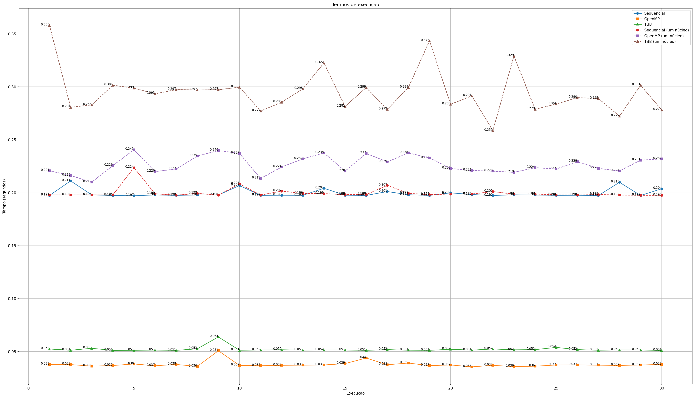
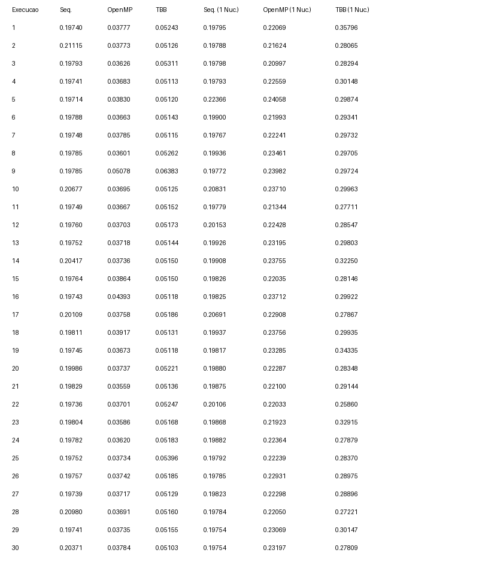

# Processos e threads

## Introdução e objetivos

Esse trabalho tem como objetivo aplicar os conceitos teóricos estudados em sala de aula sobre processos e threads.
Para isso, será utilizado um programa em C++ para executar a soma dos elementos de um vetor de 10⁸ elementos.
Após a execução, será observado os tempos de execução do programa em múltiplos núcleos e em um núcleo único do processador, com isso, ficará demonstrado a diferança das execuções de um processo linear de forma sequencial e paralela, observando também as consequencias em diferentes circustâncias de hardware.

Esse programa pode ser executado de duas formas:

- Compilando e executando o programa em C++
- Executando o programa com python

### Compilando e executando o programa em C++

Na raiz do projeto, acesse a pasta program_cpp

```bash
cd program_cpp
```

Adicione a biblioteca TBB ao sistema, se ainda não estiver instalada

```bash
sudo apt update
sudo apt install libtbb-dev
```

Compile o programa incluindo a biblioteca OpenMP

```bash
g++ -o somar_vetor.exe main.cpp -fopenmp -ltbb
```

Execute o programa

```bash
./somar_vetor.exe
```

O programa irá imprimir o tempo de execução de cada método de processamento.

Para executar o programa em um único núcleo, execute o programa com o seguinte comando:

```bash
taskset -c 0 ./somar_vetor.exe
```

### Executando o programa com python

Com o programa em C++ já compilado, na raiz do projeto, acesse a pasta graphics

```bash
cd graphics
```

É necessário criar um ambiente virtual para executar o programa em python, [veja a documentação.](https://docs.python.org/pt-br/3/library/venv.html)

Crie e ative o ambiente virtual para instalar as dependências do projeto

```bash
python -m venv venv
source venv/bin/activate
```

Adicione as dependências do projeto, lista no arquivo `requirements.txt`

```bash
pip install -r requirements.txt
```

Execute o programa

```bash
python main.py
```

O programa irá perguntar quantas vezes os tempos de execução devem ser medidos.
Em seguida irá executar o programa em C++, medindo os seus tempos de execução em múltiplos núcleos e em um núcleo único do processador, imprimir a média e o devio padrão dos tempos e gerar os gráficos de tempo de execução.

## Metodologia

O programa em C++ realiza a soma dos elementos de um vetor de 10⁸ elementos de forma sequencial e paralela, com as bibliotecas OpenMP e TBB e mede o tempo de execução de cada uma das abordagens.

O tempo de execução é medido com a biblioteca `chrono` do C++ em tempo de execução, considerando apenas o escopo da soma dos elementos do vetor, para maior precisão. O tempo de execução total pode ser medido com o comando `time` do linux, mas, mesmo em um programa isolado para cada abordagem, haveria diferenças de tempo de execução, pois esse segundo método consideraria o tempo total de execução e não apenas a soma dos elementos do vetor.

### Execução sequencial

A execução sequencial é feita com um laço de repetição simples. Uma variável armazena o tempo de inicio da execução e o tempo de fim da execução, para que seja calculado o tempo de execução.

```cpp
int resultado_sequencial = 0;
auto inicio_sequencial = std::chrono::high_resolution_clock::now();
for (int i = 0; i < N; i++)
{
 resultado_sequencial += vetor[i];
}
auto fim_sequencial = std::chrono::high_resolution_clock::now();
std::chrono::duration<double> duracao_sequencial = fim_sequencial - inicio_sequencial;
```

### Execução paralela com OpenMP

O mesmo laço de repetição é utilizado, porém é utilizado a biblioteca OpenMP para realizar a paralelização.

```cpp
int resultado_paralelo_omp = 0;
 auto inicio_paralela_omp = std::chrono::high_resolution_clock::now();
#pragma omp parallel for reduction(+ : resultado_paralelo_omp)
 for (int i = 0; i < N; ++i)
 {
  resultado_paralelo_omp += vetor[i];
 }
 auto fim_paralela_omp = std::chrono::high_resolution_clock::now();
 std::chrono::duration<double> duracao_paralela_omp = fim_paralela_omp - inicio_paralela_omp;
```

### Execução paralela com TBB

O mesmo laço de repetição é utilizado, porém é utilizado a biblioteca TBB para realizar a paralelização.

```cpp
 auto inicio_paralela_tbb = std::chrono::high_resolution_clock::now();
 int resultado_paralelo_tbb = tbb::parallel_reduce(
  tbb::blocked_range<int>(0, N), 0,
  [&](const tbb::blocked_range<int> &r, int soma_thread) -> int
  {
   for (int i = r.begin(); i < r.end(); ++i)
    soma_thread += vetor[i];
   return soma_thread;
  },
  std::plus<int>());
 auto fim_paralela_tbb = std::chrono::high_resolution_clock::now();
 std::chrono::duration<double> duracao_paralela_tbb = fim_paralela_tbb - inicio_paralela_tbb;
```

## Resultados

Todos os testes foram executados com um processador de 6 núcleos e 12 threads.
Durante uma das execuçãos, os seguintes dados foram obtidos:

### Gráficos de tempo de execução



### Tabela de tempo de execução



### Média de tempos

#### Média em múltiplos núcleos

- Média sequencial: 0.199404733
- Média OpenMP: 0.03784877
- Média Intel TBB: 0.0521151533

#### Média em um núcleo único

- Média sequencial: 0.199971066
- Média OpenMP: 0.2265345
- Média Intel TBB: 0.294907166

### Desvio padrão de tempos

#### Devio padrão em múltiplos núcleos

- Desvio padrão sequencial: 0.0037987002580586312
- Desvio padrão OpenMP: 0.00284599685343442
- Desvio padrão Intel TBB: 0.0023078191327465985

#### Devio padrão em núcleo único

- Desvio padrão sequencial: 0.00511932370219115
- Desvio padrão OpenMP: 0.008173279237857961
- Desvio padrão Intel TBB: 0.020635977267841

Os resultados obtidos mostram que, em múltiplos núcleos, as execuções paralelas com OpenMP e TBB são mais eficientes do que a execução sequencial, sendo a OpenMP a abordagem mais eficiente, porém, a execução paralela com TBB possui um desvio padrão menor do que a execução paralela com OpenMP, tendo resultados mais sólidos.

No entanto, na execução com um único núcleo, a execução sequencial não sofre muitas alterações em relação à execução em vários núcleos, enquanto as execuções paralelas com OpenMP e TBB aumentam significativamente o tempo de execução.
Nessa abordagem, a biblioteca TBB possui um desvio padrão maior e tempo médio maior do que a OpenMP, que mais uma vez se mostrou mais eficiente.

## Conclusão

Observando as abordagens e os resultados, é notável que a execução paralela é vantajosa em múltiplos núcleos, sendo a OpenMP a abordagem mais eficiente, enquanto em um único núcleo é possível observar que existe um custo para a criação e alternância em processos paralelos pelo processador.
